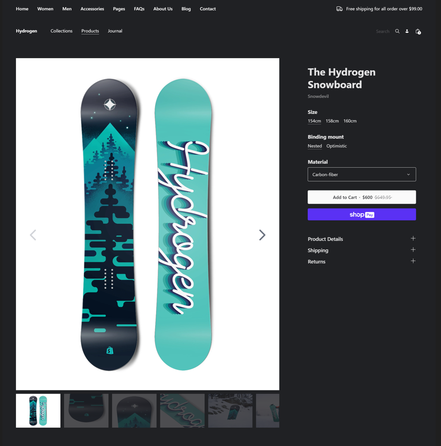

# Hydrogen template: Demo Store

## Demo Result



Demo result video go to 👉 `public/demo-result-2.webm`

## Getting started

**Requirements:**

- Node.js version 16.14.0 or higher

```bash
npm create @shopify/hydrogen@latest -- --template demo-store
```

Remember to update `.env` with your shop's domain and Storefront API token!

## Building for production

```bash
npm run build
```

## Local development

```bash
npm run dev
```
